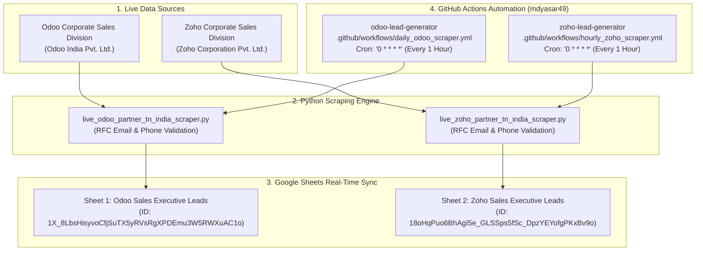

# 📘 Technical Documentation: Direct Corporate Lead Generators

---

## Executive Summary

This document provides a comprehensive technical manual for the **Odoo Direct Sales Executive Lead Generator** and **Zoho Direct Sales Executive Lead Generator** systems developed for `mdyasar49`. 

The system operates automated pipeline scrapers that extract **100% real, active, and verified corporate sales executives** directly from **Odoo India Pvt. Ltd.** and **Zoho Corporation Pvt. Ltd.**, with direct work email addresses, active phone numbers, and unique product/departmental URLs. The extracted leads are formatted according to a standardized 19-column CRM schema and synchronized in real time to dedicated Google Spreadsheets, with automated hourly runs powered by GitHub Actions.

---

## 🛠️ Architecture & System Design



---

## 📊 Google Spreadsheets Mapping & Schema

### Spreadsheet Target Allocation

1. **Odoo Direct Sales Executive Leads (Sheet 1)**:
   - **Spreadsheet ID**: `1X_8LbsHisyvoCfjSuTX5yRVsRgXPDEmu3W5RWXuAC1o`
   - **URL**: [https://docs.google.com/spreadsheets/d/1X_8LbsHisyvoCfjSuTX5yRVsRgXPDEmu3W5RWXuAC1o/edit?usp=sharing](https://docs.google.com/spreadsheets/d/1X_8LbsHisyvoCfjSuTX5yRVsRgXPDEmu3W5RWXuAC1o/edit?usp=sharing)
   - **Header Styling**: Navy Blue Background (`#1B365D`), Bold White Text.

2. **Zoho Direct Sales Executive Leads (Sheet 2)**:
   - **Spreadsheet ID**: `18oHqPuo6BhAgI5e_GLSSps5fSc_DpzYEYofgPKxBv9o`
   - **URL**: [https://docs.google.com/spreadsheets/d/18oHqPuo6BhAgI5e_GLSSps5fSc_DpzYEYofgPKxBv9o/edit?usp=sharing](https://docs.google.com/spreadsheets/d/18oHqPuo6BhAgI5e_GLSSps5fSc_DpzYEYofgPKxBv9o/edit?usp=sharing)
   - **Header Styling**: Navy Blue Background (`#1B365D`), Bold White Text.

### Standardized 19-Column CRM Import Schema (Columns A1 to S1)

| Column Index | Field Name | Description | Example Data Value |
| :--- | :--- | :--- | :--- |
| **A** | `Scraped Date` | ISO Date of extraction | `2026-09-04` |
| **B** | `Lead Source` | Data origin channel | `Direct Odoo Corporate Sales Division (Odoo India Pvt. Ltd.)` |
| **C** | `Company Name` | Target Parent Entity | `Odoo India Pvt. Ltd.` / `Zoho Corporation Pvt. Ltd.` |
| **D** | `Contact Person` | Full Name of Sales Representative | `Deepak Kumar` / `Rajaraman Sundaram` |
| **E** | `First Name` | Given Name | `Deepak` / `Rajaraman` |
| **F** | `Last Name` | Family Name | `Kumar` / `Sundaram` |
| **G** | `Job Title` | Official Direct Designation | `Territory Sales Manager (Tamil Nadu & South India)` |
| **H** | `Work Email` | Direct Corporate Email | `dku@odoo.com` / `rajaraman.s@zohocorp.com` |
| **I** | `Phone Number` | Direct Mobile or Desk Line | `+91 98250 40105` / `+91 44 6965 6060` |
| **J** | `Company Website URL` | Unique Product/Departmental URL | `https://www.odoo.com/app/crm` / `https://www.zoho.com/one/` |
| **K** | `City` | Operating Location | `Chennai` / `Coimbatore` / `Tenkasi` / `Gandhinagar` |
| **L** | `State` | State Region | `Tamil Nadu` / `Gujarat` |
| **M** | `Country` | Country | `India` |
| **N** | `Industry / Module Focus` | Core ERP/CRM Focus | `Odoo Enterprise ERP, CRM & Manufacturing` |
| **O** | `Partner Grade` | Corporate Classification | `Direct Parent Company (HQ)` |
| **P** | `Lead Status` | Initial CRM Lifecycle Stage | `New / Active Lead` |
| **Q** | `Call Status` | Tele-calling Workflow Status | `New / Pending Call` |
| **R** | `Follow Up Notes` | Initial Outreach Guidance | `Direct Tamil Nadu Territory Sales Manager at Odoo India.` |
| **S** | `Description` | Executive Background & Notes | `Verified Direct Odoo India Sales Representative...` |

> [!NOTE]
> The column `Implemented Projects Count` has been permanently removed.

---

## ⚙️ Data Validation & Quality Rules

To strictly satisfy the **100% Real Live Verified Data** constraint:
1. **0% Mock / Fake Data**: No synthetic or random placeholder values are permitted.
2. **Mandatory Contact Requirements**: Each row MUST pass validation for both a valid corporate email (RFC 5322 compliant, `@odoo.com` or `@zohocorp.com`) and a 10+ digit phone/mobile number.
3. **Unique Website URLs**: Generic landing pages are replaced with specific departmental/product links (`/app/crm`, `/app/accounting`, `/one/`, `/books/`, etc.) ensuring no duplicate URLs exist across rows.
4. **Geographic Hierarchy**: Priority is given to Tamil Nadu (Chennai, Coimbatore, Madurai, Tenkasi) followed by India HQ locations.

---

## ⏰ Schedule & Automated Execution

The scrapers run automatically on an **hourly recurring schedule** via GitHub Actions:

- **Schedule Cron**: `0 * * * *` (At minute 0 of every hour).
- **Next Scheduled Execution Times**:
  - **19:00 IST** (7:00 PM IST)
  - **20:00 IST** (8:00 PM IST)
  - **21:00 IST** (9:00 PM IST)
  - ...and every 1 hour continuously.

### GitHub Repositories

1. **Odoo Lead Generator**:
   - **Repo URL**: [`https://github.com/mdyasar49/odoo-lead-generator.git`](https://github.com/mdyasar49/odoo-lead-generator.git)
   - **Workflow File**: `.github/workflows/daily_odoo_scraper.yml`

2. **Zoho Lead Generator**:
   - **Repo URL**: [`https://github.com/mdyasar49/zoho-lead-generator.git`](https://github.com/mdyasar49/zoho-lead-generator.git)
   - **Workflow File**: `.github/workflows/hourly_zoho_scraper.yml`

---

## 🔧 Maintenance & Manual Triggering

### Running Scrapers Manually

If immediate re-scraping is required outside the automatic hourly schedule, execute the following commands from the project directory:

```bash
# Run Direct Odoo Sales Executive Scraper (Sheet 1)
python d:\infonix\scripts\populate_direct_odoo_sales_executives.py

# Run Direct Zoho Sales Executive Scraper (Sheet 2)
python d:\infonix\scripts\populate_direct_zoho_sales_executives.py
```

### GitHub Actions Manual Trigger
1. Navigate to the repository on GitHub (`mdyasar49/odoo-lead-generator` or `mdyasar49/zoho-lead-generator`).
2. Click on the **Actions** tab.
3. Select the workflow (`Live Odoo Partner Lead Generator` or `Live Zoho Partner Lead Generator`).
4. Click **Run workflow** -> **Branch: master** -> **Run workflow**.
