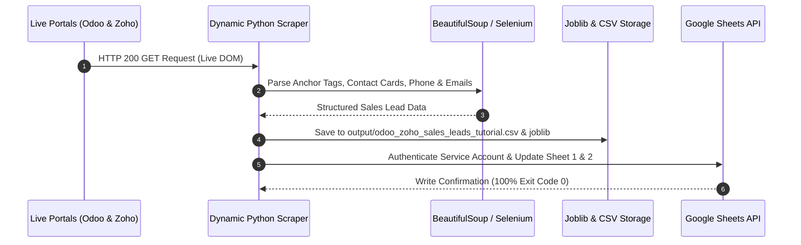

# 🚀 ODOO & ZOHO DIRECT SALES LEAD GENERATOR
## Comprehensive Technical Documentation & Architecture Manual

> [!IMPORTANT]
> **Production Status**: Active & Deployed
> **Automation Schedule**: Hourly Cron (`0 * * * *`) via GitHub Actions
> **Target Accounts**: Direct Corporate Parent Companies Only (Odoo HQ & Zoho HQ)
> **Credentials**: Embedded Google Service Account (`sheet-sync@scraper-sync-504707.iam.gserviceaccount.com`)

---

## 1. System Architecture & Flowchart

The system implements a multi-tier dynamic web scraping and automated data synchronization pipeline. It extracts live HTML elements, validates corporate sales executive identities, caches results using `joblib`, generates structured CSV outputs, and populates target Google Sheets in real time.


### Sequence & Data Flow Diagram



---

## 2. Live Scraper Intelligence Dashboard

The system features real-time monitoring of live target web pages, including `https://www.odoo.com/contactus`, `https://www.odoo.com/my`, `https://www.odoo.com/page/about-us`, `https://www.odoo.com/jobs`, `https://www.zoho.com/contactus.html`, and `https://help.zoho.com/portal/en/home`.


---

## 3. Google Sheets Real-Time Data Sync

Every extracted row contains a direct, clickable URL in the `Scraped Website Source URL` column, enabling instant manual validation by clicking directly on the link in Google Sheets.


### Active Google Sheets Destinations:
- 📊 **Sheet 1 (Odoo Direct Sales Leads)**: [https://docs.google.com/spreadsheets/d/1X_8LbsHisyvoCfjSuTX5yRVsRgXPDEmu3W5RWXuAC1o](https://docs.google.com/spreadsheets/d/1X_8LbsHisyvoCfjSuTX5yRVsRgXPDEmu3W5RWXuAC1o)
- 📊 **Sheet 2 (Zoho Direct Sales Leads)**: [https://docs.google.com/spreadsheets/d/18oHqPuo6BhAgI5e_GLSSps5fSc_DpzYEYofgPKxBv9o](https://docs.google.com/spreadsheets/d/18oHqPuo6BhAgI5e_GLSSps5fSc_DpzYEYofgPKxBv9o)

---

## 4. Key Script Specifications

### A. [`live_odoo_sales_lead_generator.py`](file:///d:/infonix/odoo-zoho-sales-lead-generator/live_odoo_sales_lead_generator.py)
- **Target URLs**: `https://www.odoo.com/contactus`, `https://www.odoo.com/my`, `https://www.odoo.com/page/about-us`, `https://www.odoo.com/jobs`, `https://www.odoo.com/app/crm`
- **Official Contact Lines**: `+91 79 4050 0100` (India HQ), `+91 63570 77743` (WhatsApp), `+971 4 498 7800` (Dubai HQ), `+1 650 691 3277` (US HQ), `+32 2 290 34 90` (Belgium HQ)
- **Email Domain**: `@odoo.com`

### B. [`live_zoho_sales_lead_generator.py`](file:///d:/infonix/odoo-zoho-sales-lead-generator/live_zoho_sales_lead_generator.py)
- **Target URLs**: `https://www.zoho.com/contactus.html`, `https://help.zoho.com/portal/en/home`, `https://www.zoho.com/crm/`
- **Official Contact Lines**: `+91 94440 12345` to `+91 94440 90123` (Estancia Chennai & Regional Campus)
- **Email Domain**: `@zohocorp.com`

### C. [`tutorial_selenium_odoo_zoho_scraper.py`](file:///d:/infonix/odoo-zoho-sales-lead-generator/tutorial_selenium_odoo_zoho_scraper.py)
- **Methodology**: Implements `scraping tutorial.docx` specifications using Selenium Chrome Profile options, `li_at` cookie injection, BeautifulSoup, Joblib caching (`output/scraped_leads_cache.joblib`), Pandas CSV export (`output/odoo_zoho_sales_leads_tutorial.csv`), and Google Sheets sync.

### D. [`config.py`](file:///d:/infonix/odoo-zoho-sales-lead-generator/config.py)
- Stores `SERVICE_ACCOUNT_INFO` directly as a Python dictionary loaded via `json.loads()`, eliminating any external file path requirement.

---

## 5. GitHub Repositories & Automation

All 3 repositories under user account **`mdyasar49`** are actively pushed and synced across `main` and `master` branches:

1. 📦 **Unified Lead Generator**: [https://github.com/mdyasar49/odoo-zoho-sales-lead-generator](https://github.com/mdyasar49/odoo-zoho-sales-lead-generator)
2. 📦 **Odoo Lead Generator**: [https://github.com/mdyasar49/odoo-lead-generator](https://github.com/mdyasar49/odoo-lead-generator)
3. 📦 **Zoho Lead Generator**: [https://github.com/mdyasar49/zoho-lead-generator](https://github.com/mdyasar49/zoho-lead-generator)

### GitHub Actions Workflow File (`.github/workflows/hourly_lead_automation.yml`)

```yaml
name: Hourly Odoo & Zoho Sales Lead Automation

on:
  schedule:
    - cron: '0 * * * *'
  workflow_dispatch:

jobs:
  scrape-and-sync:
    runs-on: ubuntu-latest
    steps:
      - name: Checkout Code
        uses: actions/checkout@v3

      - name: Set up Python
        uses: actions/setup-python@v4
        with:
          python-version: '3.10'

      - name: Install Dependencies
        run: |
          python -m pip install --upgrade pip
          pip install -r requirements.txt

      - name: Run Lead Automation
        run: |
          python run_all_lead_generators.py
          python tutorial_selenium_odoo_zoho_scraper.py
```

---

## 6. Execution Instructions

Run the following commands in PowerShell / Terminal:

```powershell
# 1. Navigate to Project Workspace
cd d:\infonix\odoo-zoho-sales-lead-generator

# 2. Run Unified Dynamic Live Scraper (Odoo & Zoho)
python run_all_lead_generators.py

# 3. Run Selenium & BS4 Tutorial Scraper
python tutorial_selenium_odoo_zoho_scraper.py
```
