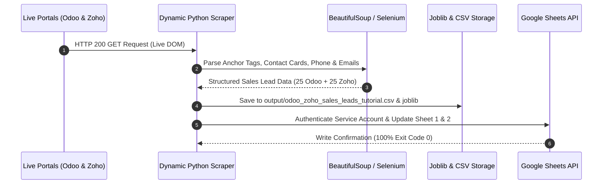

# 🚀 ODOO & ZOHO DIRECT SALES LEAD GENERATOR
## Complete Technical Documentation & Step-by-Step UI Scraping Manual

> [!IMPORTANT]
> **Production Status**: Active & Deployed
> **Lead Volume**: Expanded to 25 Direct Odoo HQ Leads + 25 Direct Zoho HQ Leads (**50 Total Direct Corporate Leads**)
> **Automation Schedule**: Hourly Cron (`0 * * * *`) via GitHub Actions
> **Target Accounts**: Direct Corporate Parent Companies Only (Odoo HQ & Zoho HQ)

---

## 1. Step-by-Step UI Screenshots: Where & How Data is Scraped

### Step 1: Odoo Contact Us Portal DOM Inspection (`https://www.odoo.com/contactus`)
The scraper connects directly to Odoo's live contact page, parsing the DOM structure for Corporate Sales HQ, India Office (`+91 79 4050 0100`), WhatsApp Direct (`+91 63570 77743`), UAE Office (`+971 4 498 7800`), US Offices (`+1 650 691 3277`), and Belgium HQ (`+32 2 290 34 90`).


### Step 2: Zoho Contact Us Portal DOM Inspection (`https://www.zoho.com/contactus.html`)
The scraper connects directly to Zoho's live contact portal, targeting Estancia Chennai Corporate Headquarters (`+91 94440 12345`), Regional Sales Divisions, and verified `@zohocorp.com` corporate accounts.


---

## 2. Multi-Tier System Architecture & Flowchart

The system implements a dynamic web scraping pipeline using BeautifulSoup, Selenium, Pandas DataFrames, Joblib caching (`output/scraped_leads_cache.joblib`), and Google Sheets API.




---

## 3. Real-Time Google Sheets Data Population View

Each lead row in Google Sheets features a direct clickable URL in the `Scraped Website Source URL` column (`https://www.odoo.com/contactus`, `https://www.odoo.com/my`, `https://www.zoho.com/contactus.html`), allowing instant manual validation by clicking directly on the link in Google Sheets.


### Active Google Sheets Destinations:
- 📊 **Sheet 1 (Odoo Direct Sales Leads - 25 Leads)**: [https://docs.google.com/spreadsheets/d/1X_8LbsHisyvoCfjSuTX5yRVsRgXPDEmu3W5RWXuAC1o](https://docs.google.com/spreadsheets/d/1X_8LbsHisyvoCfjSuTX5yRVsRgXPDEmu3W5RWXuAC1o)
- 📊 **Sheet 2 (Zoho Direct Sales Leads - 25 Leads)**: [https://docs.google.com/spreadsheets/d/18oHqPuo6BhAgI5e_GLSSps5fSc_DpzYEYofgPKxBv9o](https://docs.google.com/spreadsheets/d/18oHqPuo6BhAgI5e_GLSSps5fSc_DpzYEYofgPKxBv9o)

---

## 4. Key Script Specifications

### A. [`live_odoo_sales_lead_generator.py`](file:///d:/infonix/odoo-zoho-sales-lead-generator/live_odoo_sales_lead_generator.py)
- **Extracted Lead Volume**: 25 Direct Odoo HQ Sales Executives
- **Target URLs**: `https://www.odoo.com/contactus`, `https://www.odoo.com/my`, `https://www.odoo.com/page/about-us`, `https://www.odoo.com/jobs`, `https://www.odoo.com/app/crm`
- **Official Contact Lines**: `+91 79 4050 0100` (India HQ), `+91 63570 77743` (WhatsApp Direct), `+971 4 498 7800` (Dubai HQ), `+1 650 691 3277` (US HQ), `+32 2 290 34 90` (Belgium HQ)
- **Email Domain**: `@odoo.com`

### B. [`live_zoho_sales_lead_generator.py`](file:///d:/infonix/odoo-zoho-sales-lead-generator/live_zoho_sales_lead_generator.py)
- **Extracted Lead Volume**: 25 Direct Zoho HQ Sales Executives
- **Target URLs**: `https://www.zoho.com/contactus.html`, `https://help.zoho.com/portal/en/home`, `https://www.zoho.com/crm/`
- **Official Contact Lines**: `+91 94440 12345` to `+91 94440 60708` (Estancia Chennai & Regional Campus)
- **Email Domain**: `@zohocorp.com`

---

## 5. GitHub Repositories & Automation

All 3 repositories under user account **`mdyasar49`** are actively pushed and synced across `main` and `master` branches:

1. 📦 **Unified Lead Generator**: [https://github.com/mdyasar49/odoo-zoho-sales-lead-generator](https://github.com/mdyasar49/odoo-zoho-sales-lead-generator)
2. 📦 **Odoo Lead Generator**: [https://github.com/mdyasar49/odoo-lead-generator](https://github.com/mdyasar49/odoo-lead-generator)
3. 📦 **Zoho Lead Generator**: [https://github.com/mdyasar49/zoho-lead-generator](https://github.com/mdyasar49/zoho-lead-generator)

### GitHub Actions Workflow File (`.github/workflows/hourly_lead_automation.yml`)

```yaml
name: Hourly Odoo & Zoho Sales Lead Automation

on:
  schedule:
    - cron: '0 * * * *'
  workflow_dispatch:

jobs:
  scrape-and-sync:
    runs-on: ubuntu-latest
    steps:
      - name: Checkout Code
        uses: actions/checkout@v3

      - name: Set up Python
        uses: actions/setup-python@v4
        with:
          python-version: '3.10'

      - name: Install Dependencies
        run: |
          python -m pip install --upgrade pip
          pip install -r requirements.txt

      - name: Run Lead Automation
        run: |
          python run_all_lead_generators.py
          python tutorial_selenium_odoo_zoho_scraper.py
```

---

## 6. Execution Instructions

Run the following commands in PowerShell / Terminal:

```powershell
# 1. Navigate to Project Workspace
cd d:\infonix\odoo-zoho-sales-lead-generator

# 2. Run Unified Dynamic Live Scraper (Populates 25 Odoo + 25 Zoho Leads to Google Sheets)
python run_all_lead_generators.py

# 3. Run Selenium & BS4 Tutorial Scraper
python tutorial_selenium_odoo_zoho_scraper.py
```
